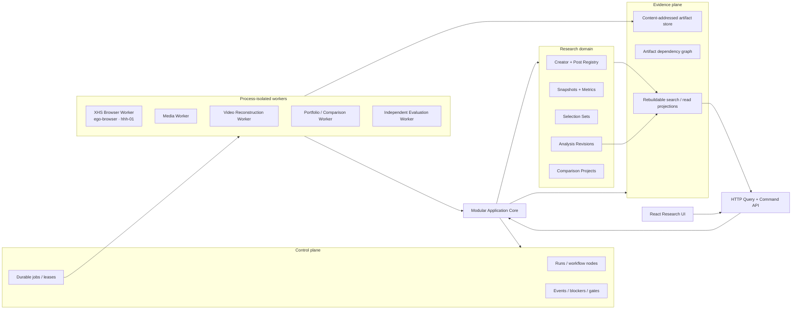

# Creator Analysis OS V1 — Ideal Architecture

Status: **proposed for Owner confirmation**
Scope: research system only; Creation Workspace remains a separate future bounded context.

## 1. Recommendation in one sentence

Build a **local-first modular monolith control plane with process-isolated workers, a relational operational ledger, an immutable content-addressed evidence store, and versioned read projections**.

This gives the current single-user desktop workflow reliable resume, provenance, and reuse without prematurely paying the operational cost of microservices. The same logical boundaries can later run with PostgreSQL and object storage for a team deployment.

## 2. Why this shape

The current system proves useful product surfaces but has four structural limits:

1. run state is stored as large JSON blobs in two separate SQLite tables;
2. completed creator pages are assembled by server-side scanning of heterogeneous artifact directories;
3. files are referenced by mutable paths rather than registered content revisions and dependency edges;
4. browser acquisition, media work, analysis, and web requests do not yet share one durable orchestration model.

Adding more creators or a multi-creator page on top of that shape would produce parallel truth, stale conclusions, and unrecoverable partial runs.

## 3. Logical architecture



## 4. Three planes

### 4.1 Control plane

Owns mutable operational state:

- research runs;
- workflow-node state;
- durable jobs, leases, attempts, and retry times;
- human handoff and blockers;
- validation gates;
- freshness and invalidation state;
- append-only operational events.

It answers “what is happening now?” It does not store raw video, frames, or full reconstructions inline.

### 4.2 Evidence plane

Owns immutable evidence and derived artifacts:

- sanitized raw page observations;
- normalized corpus revisions;
- source media and subtitles;
- frames, OCR, audio inspection, transcripts, and manifests;
- reconstruction, evaluation, and gate reports;
- creator and comparison analysis artifacts.

Artifacts are addressed by SHA-256 content hash and registered with schema version, media type, visibility, producing job, source revision, and limitations.

### 4.3 Read plane

Owns rebuildable UI projections:

- Research Home rows;
- single-video view model;
- creator overview and portfolio metrics;
- the canonical 21-record List/Gallery dataset;
- multi-creator normalized tables and matrices;
- evidence drawer payloads.

The UI never scans artifact directories or interprets raw pipeline files. It reads versioned API projections.

## 5. Bounded contexts

### Source Registry

Stable identity for platform accounts, creators, posts, and canonical URLs. Platform IDs and internal UUIDs are separate.

### Acquisition

Authenticated read-only browser broker, identity resolution, convergent crawling, detail enrichment, metric snapshots, comments scope, media candidate resolution, and sanitized observations.

### Evidence

Content-addressed files, artifact manifests, typed evidence references, media verification, and dependency/invalidation graph.

### Reconstruction

Video evidence pack, probe, capture protocol, targeted evidence, OCR/audio checks, reconstruction, independent evaluation, and hard gates.

### Portfolio Research

Full-corpus statistics, open annotations, High/Base/Low selection, creator synthesis, user value, rhythm, evolution, growth-engine observations, lifecycle, and business-path evidence.

### Comparison Research

Pinned creator-analysis revisions, aligned windows, normalized metrics, cross-creator matrices, classified conclusions, and drill-down evidence.

### Query Projection

Frontend-specific read models and cache invalidation. It has no authority to invent or repair missing research fields.

### Creation Workspace

Future separate context. It may reference immutable creator/video analysis revisions, but research does not depend on creation outputs.

## 6. Module shape in the repository

The target remains one TypeScript repository, organized by domain instead of layer-only folders:

```text
src/
  modules/
    creator-detail/
    creator-research/
    creator-synthesis/
    media-resolution/
    video-analysis/
    portfolio/
    comparison/              # pinned comparison projects + pure analyzer + worker
    orchestration/
  platform/
    browser/                 # ego-browser adapter; hhh-01 stays private
    media/                   # signed URL consumption + verified local evidence
    video/                   # isolated reconstruction/evaluator processes
    synthesis/               # creator-level evidence synthesis
    database/                # SQLite WAL repositories
    artifacts/
    network/
  server/                    # HTTP commands and read projections
  client/                    # existing Dashboard + live task/progress views
  shared/                    # cross-boundary runtime schemas
```

Workers currently run as process-isolated adapters supervised by the API process. The durable
job and lease contracts live in the domain modules, so these supervisors can move into separate
deployments later without changing the research contracts.

The implemented package dependency direction is:

```text
client -> HTTP projections -> module services -> repository / executor ports
                                              -> platform adapters

comparison project -> pinned creator portfolio revisions -> immutable comparison artifact
video job -> verified local media -> candidate -> independent evaluator -> hard gate
creator synthesis -> canonical 21 + nine ready video gates -> research-only projection
```

Each module owns commands, queries, policies, repositories, and events. Workers call application commands and return registered artifacts; they do not update unrelated tables directly.

## 7. Deployment profiles

### Profile A — local/private, recommended first

```text
React + Express API process
Worker supervisor process
SQLite WAL operational database
Local content-addressed artifact directory
ego-browser broker on the user's machine
SSE progress stream
```

Recommended concurrency:

- Xiaohongshu browser jobs: 1 per authenticated TaskSpace;
- media verification/download: 2;
- video reconstruction: configurable 1–3 based on CPU/GPU and evidence size;
- portfolio/comparison synthesis: 1–2.

### Profile B — team/server, compatible later

```text
API containers
PostgreSQL operational database and durable job leasing
S3-compatible private object storage
stateless analysis/media workers
desktop/private browser worker connected through a narrow sanitized-job channel
SSE or WebSocket progress gateway
```

The authenticated browser remains on an approved private machine. The server receives only sanitized observations and registered safe artifacts—not cookies, local profile paths, or signed URLs.

## 8. Technology decisions

- **Keep React, React Router, TypeScript, Express, and shared runtime validation.** They already fit the product and avoid a rewrite.
- **Use SQLite WAL first, PostgreSQL later through repository interfaces.** The local profile is the real primary use case today.
- **Do not introduce Redis/BullMQ in the local profile.** A leased SQL job table is sufficient and easier to recover and inspect.
- **Use content-addressed storage for evidence.** File paths become implementation details behind `ArtifactStore`.
- **Use Server-Sent Events for progress.** The flow is server-to-client and does not need WebSocket complexity.
- **Use canonical cross-language JSON Schemas for persisted artifacts.** TypeScript validators/types should be generated or emitted from one contract source; do not maintain two hand-written schema definitions.
- **Do not use a vector database as source of truth.** Full-text/vector indexes may be rebuildable secondary search aids later.

## 9. Architecture invariants

1. One internal ID per creator/post, with platform aliases—not directory names as identity.
2. Every collection produces an immutable snapshot revision.
3. Every analysis revision pins exact input artifact IDs and schema/skill versions.
4. Every conclusion uses typed evidence references; prose cannot cite an arbitrary path string.
5. A downstream revision becomes stale when an input dependency changes.
6. Metric-only changes do not invalidate media reconstruction when the media hash is unchanged.
7. A fixture can validate workflow compatibility but cannot produce `ready` research.
8. Browser authentication never crosses into the public artifact or API data plane.
9. Research projections contain no creation advice.
10. The UI reads projections; generated static HTML is an optional export, not canonical truth.

## 10. Alternatives deliberately rejected

| Alternative | Why not |
| --- | --- |
| Keep one giant JSON row per run | Poor querying, partial updates, invalidation, and auditability |
| Continue scanning arbitrary artifact folders in API handlers | Creates path-coupled and stale parallel truth |
| Microservices now | Too much deployment and observability cost for a local-first product |
| Redis queue in V1 | Adds infrastructure without solving a current scale limit |
| Deep-download every creator video | High cost, platform risk, and no proportional analytical gain |
| Static HTML as primary product | Duplicates state and cannot reliably reflect freshness or blockers |
| Event-source the entire domain | Operational events are useful; full event sourcing is unnecessary complexity |
| Vector search as evidence | Similarity is not provenance and cannot close evidence gates |

## 11. Migration strategy

1. Add the contract registry, artifact registry, and shared IDs without changing current pages.
2. Replace the two run JSON tables with unified runs, workflow nodes, jobs, events, and blockers.
3. Import existing creator/post identities and register current artifacts by hash without moving or rewriting them initially.
4. Build the acquisition worker and canonical snapshot/corpus pipeline.
5. Integrate video reconstruction through registered input/output artifacts and gates.
6. Build creator read projections and migrate the existing Dashboard to API data.
7. Add comparison projects and multi-creator projections.
8. Remove server artifact-directory scanning only after projection parity tests pass.
9. Add optional offline HTML export from the same projection contract.

The migration is additive and reversible until step 8.
