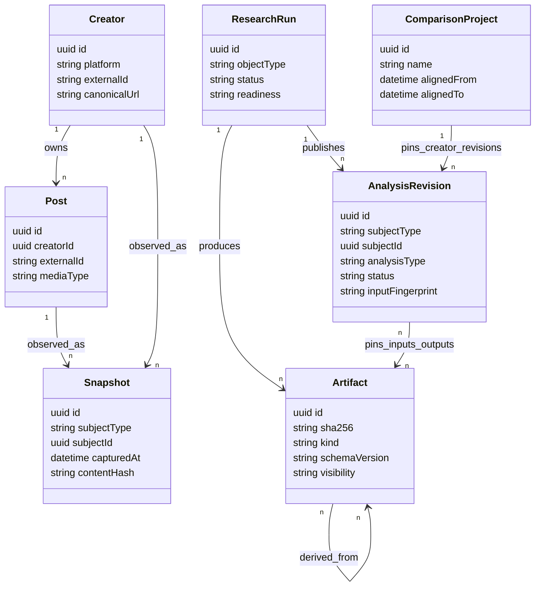

# Creator Analysis OS V1 — Canonical Data Model

Status: **proposed logical model; physical SQL types and migrations follow confirmation**

## 1. Modeling rule

Separate five things that are currently easy to mix:

1. **Entity** — the stable creator or post identity.
2. **Snapshot** — what public data was observed at a time.
3. **Artifact** — immutable raw or derived evidence bytes/JSON.
4. **Revision** — one reproducible analytical interpretation pinned to inputs.
5. **Run** — mutable operational work used to produce snapshots, artifacts, and revisions.

## 2. Core relationships



## 3. Identity model

### Internal IDs

Use UUIDs for internal identity. Never use creator display name, artifact directory, list position, or current URL token as the primary identity.

### Platform aliases

`external_identities` maps:

| Field | Meaning |
| --- | --- |
| `entity_type` | `creator` or `post` |
| `entity_id` | internal UUID |
| `platform` | `xiaohongshu`, later `x`, `youtube`, etc. |
| `external_id` | stable platform ID |
| `canonical_url` | sanitized canonical URL |
| `observed_alias` | display/user IDs when useful |
| `valid_from/valid_to` | historical alias range |

Unique constraint: `(platform, entity_type, external_id)`.

Short/share URLs are resolver inputs, never stable identity.

## 4. Operational relational catalog

### Registry

| Table | Role | Important fields |
| --- | --- | --- |
| `creators` | stable creator entity | `id`, `platform`, `external_id`, `created_at` |
| `posts` | stable post entity | `id`, `creator_id`, `platform`, `external_id`, `media_type` |
| `external_identities` | aliases and canonical URLs | entity key, platform key, URL, validity |

### Snapshots and public data

| Table | Role | Important fields |
| --- | --- | --- |
| `profile_snapshots` | append-only public profile state | creator, captured time, display fields, artifact ID |
| `post_snapshots` | append-only post metadata state | post, captured time, title/copy/date/duration, artifact ID |
| `metric_snapshots` | append-only public metric state | post, captured time, likes/collections/comments/shares nullable |
| `field_candidates` | conflicting extraction candidates | snapshot, field, value JSON, source, confidence, status |
| `comment_snapshots` | scoped public-comment capture | post, captured time, scope/denominator, artifact ID |

Metrics are nullable. `0` means a visible verified zero; `null` means unavailable.

### Artifacts and provenance

| Table | Role | Important fields |
| --- | --- | --- |
| `artifacts` | immutable artifact registry | ID, SHA-256, kind, schema, MIME, bytes, storage key, visibility |
| `artifact_edges` | dependency/invalidation graph | parent artifact, child artifact, edge kind |
| `artifact_subjects` | attaches artifact to creator/post/run/revision | subject type/ID, artifact ID, role |
| `evidence_index` | searchable typed evidence references | artifact ID, evidence type/ID, time range, selector |

`storage_key` is provider-relative. Local absolute paths and public URLs are not domain data.

### Research and selection

| Table | Role | Important fields |
| --- | --- | --- |
| `analysis_revisions` | immutable analysis publication | subject, type, input fingerprint, output artifact, status |
| `annotations` | open multi-label post annotations | post, taxonomy namespace, label, evidence, revision |
| `selection_sets` | one creator comparison selection revision | creator, corpus revision, rule version, status |
| `selection_items` | canonical 21 records and deep flags | selection set, post, tier, anchors, rank, reason, deep flag |
| `conclusions` | indexed claims from an analysis revision | scope class, provenance, confidence, text, reasoning |
| `conclusion_evidence` | typed evidence links for conclusions | conclusion, evidence reference |
| `research_concepts` | stable open-taxonomy identity | slug, kind, current revision, current scope/status |
| `research_concept_revisions` | immutable definition/scope decision | concept, parent, definition, exclusions, change type, scope before/after |
| `research_observations` | evidence-backed concept occurrence/counterexample | concept revision, subject, relation, condition, analysis revision, confidence, gate state |
| `concept_revision_observations` | included/excluded decision ledger | revision, observation, inclusion, exclusion reason |
| `learning_loop_runs` | persisted runtime attempt around a concept decision | pinned subject/revision, state, terminal outcome, stop reason, input/allowlist fingerprint |
| `learning_loop_nodes` | immutable-DAG node ledger | run, role, node state, allowed input artifact IDs, input fingerprint, output artifact ID |
| `learning_evaluations` | independent judge/blind/meta results | run, evaluator role, verdict, failure class, artifact ID, gate result |
| `learning_regression_cases` | pinned old-three/new/holdout evaluation membership | run, cohort, subject/revision, sealed-at, result, artifact ID |
| `parity_manifests` | source-to-canonical migration proof | creator revision, contract version, source hashes/counts, mapping artifact, gate result |

### Multi-creator comparison

| Table | Role | Important fields |
| --- | --- | --- |
| `comparison_projects` | comparison scope | name, platform, full-history flag, aligned window, status |
| `comparison_members` | pinned creator revisions | project, creator, creator-analysis revision, role/comparability |
| `comparison_revisions` | reproducible comparison result | project, member fingerprint, output artifact, status |
| `comparison_conclusions` | indexed classified findings | revision, class, text, confidence |

Conclusion class is one of:

- `track_wide`;
- `creator_specific`;
- `conditional`;
- `anomaly`;
- `unknown`.

### Orchestration

| Table | Role | Important fields |
| --- | --- | --- |
| `research_runs` | one requested research operation | object type/ID, requested revision, status, readiness |
| `workflow_nodes` | persisted DAG node state | run, node key, dependencies, state, input fingerprint |
| `jobs` | leased worker work item | kind, subject, idempotency key, lease, attempts, next run |
| `job_events` | append-only operational audit | job/run, event type, timestamp, safe payload |
| `blockers` | user/system blockers | run/node, code, action required, resolved time |
| `gate_results` | deterministic/independent gates | subject revision, gate, numerator/denominator, pass, evidence |

## 5. Rich artifact contracts

Do not flatten every transcript cue, frame, OCR line, or relationship into SQL. Keep rich domain artifacts as schema-validated immutable JSON and index only what UI/query needs.

### Video reconstruction artifact family

```text
evidence-pack
probe
capture-protocol
targeted-evidence
ocr/audio evidence
reconstruction
independent evaluation
gate report
readable article
```

The reconstruction projection must expose three independently auditable analytical views:

- `content_restoration`: thesis, article, knowledge units, transcript, claims, examples, limits, and relationships;
- `directing_logic`: viewer questions, cognitive changes, promise/proof/payoff order, information load, transitions, and credibility design;
- `visual_editing_logic`: composition, carriers, shots, cut rhythm, sparse/dense frames, UI/OCR, before/during/after states, and non-speech audio.

Presence is not completeness. Each view records coverage, evidence references, conflicts, unknowns, and evaluation state.

The exact fields, structural minima, four independent gates, and page projection order are normative in [three-lens-video-contract.md](three-lens-video-contract.md). The three coverage objects never collapse into one averaged score.

### Creator artifact family

```text
collection inventory
collection status
normalized corpus
corpus statistics
canonical selection set
creator analysis
creator read projection
```

The creator read projection must retain, rather than flatten:

- corpus percentiles, distribution, head count/concentration, coverage and data-health notes;
- structured topic and format clusters with count/share/median/mean/maximum/high share;
- High/Base/Low tier metrics, patterns, mechanisms, failure conditions, and confounds;
- per-record public metrics, relative position, core content, content architecture, mechanism, anchors, and evidence state;
- provenance scope distinguishing full corpus, 21-record comparison, and 9-video reconstruction evidence.

The three reference migrations additionally emit the immutable manifest and count assertions in [creator-depth-parity.md](creator-depth-parity.md). `registeredDeep` and `canonicalDeep` are separate counts so a source evidence package outside the canonical nine remains retained and addressable.

### Comparison artifact family

```text
comparison scope
pinned member revisions
normalization report
value/topic/format matrices
classified conclusion ledger
comparison read projection
```

## 6. Typed evidence reference

Every core conclusion uses this logical shape:

```json
{
  "artifactId": "uuid",
  "refType": "cue|shot|frame|ocr|source|metric|annotation|analysis",
  "refId": "CUE-014",
  "timeRangeMs": { "start": 23500, "end": 27100 },
  "selector": { "jsonPointer": "/transcript/13" },
  "role": "supports|contradicts|qualifies|scope|unknown_boundary"
}
```

Rules:

- `artifactId + refType + refId` must resolve.
- Time range is required for time-based video evidence.
- A path string alone is not evidence.
- Negative evidence also carries the inspected scope and sought carrier.
- OCR references include source frame and review state.

## 7. Revision model

An `analysis_revision` is immutable and contains:

- subject ID and analysis type;
- exact input artifact IDs/hashes;
- contract/schema versions;
- skill/model/tool versions when material;
- output artifact ID;
- validation/evaluation status;
- created time and producing run;
- readiness and explicit limitations.

The mutable subject record stores only `current_revision_id`. Publishing a new revision atomically changes that pointer after gates pass.

## 8. Input fingerprints and idempotency

Build deterministic fingerprints from sorted inputs:

```text
sha256(
  jobKind
  + subjectId
  + inputArtifactHashes
  + contractVersions
  + relevantParameters
)
```

The same fingerprint reuses the prior successful output. A failed/retry job can run again, but cannot create competing authoritative outputs for the same fingerprint.

Learning-loop nodes additionally persist an `allowed_input_artifact_ids` allowlist. Every actual input must be a member, resolve to its registered SHA-256, and be included in the node fingerprint. The data model and terminal semantics for this loop are normative in [learning-loop-contract.md](learning-loop-contract.md); no agent conversation or unregistered discovery result is a valid artifact input.

## 9. High / Base / Low model

`selection_items.tier` is exactly `high | base | low`.

Base anchors are multi-valued:

- `median_near`;
- `mean_near`;
- `typical_form`;
- `mean_lower_boundary`;
- `mean_upper_boundary`.

If no post is within the accepted distance of the arithmetic mean, record `mean_gap=true` and use boundary anchors. Mean-near is not promoted into a fourth user-facing tier.

The canonical comparison set is one `selection_set`. `deep_selected=true` marks the nine deep records inside it.

## 10. Multi-creator reproducibility

A comparison revision pins:

- member creator IDs;
- exact creator-analysis revision IDs;
- metric snapshot cutoff;
- aligned time window and timezone;
- normalization version;
- annotation/taxonomy versions;
- excluded/special-case member reasons.

It never reads an unpinned “latest” creator analysis during computation. If a member publishes a newer revision, the comparison becomes `stale_available`, not silently different.

## 11. Data retention and visibility

Visibility classes:

- `private_transient` — signed URLs, download candidates, session-bound details; TTL and never public;
- `private_raw` — authenticated raw snapshots and source media;
- `internal_sanitized` — normalized evidence and analysis;
- `public_safe` — redacted projection/export safe for a public repository.

Garbage collection may remove unreferenced transient artifacts after TTL. Immutable evidence referenced by a published revision is retained until the revision is explicitly retired.

## 12. Research-learning model

`research_concepts.kind` is one of:

- `content_mechanism`;
- `directing_device`;
- `visual_grammar`;
- `proof_mode`;
- `failure_mode`;
- `value_mode`;
- `condition`.

`research_observations.relation` is exactly `confirm | qualify | contradict`; `gate_state` is `eligible | quarantined | invalid`. An eligible observation pins one subject, one analysis revision, a machine-readable condition, and at least one resolvable evidence reference. One video supplies at most one independent vote to one concept revision.

Concept definition, exclusions, scope, status, and evidence membership change only through an immutable revision. Promotion and invalidation rules are defined in [research-learning-model.md](research-learning-model.md); implementations must reproduce their creator and cross-creator thresholds from stored observations rather than a generated summary.

`learning_loop_runs.state` is `draft | sampling | creator_running | video_evaluating | blind_testing | diagnosing | repair_queued | regression_testing | observation_adjudicating | promoted | completed_no_promotion | blocked | failed | stale`. `terminal_outcome` is `promoted | completed_no_promotion | blocked | failed | stale`; `rejected` is a `failure_reason`, never a state. `completed_no_promotion` means evidence collection and independent evaluation completed under the declared bounded plan but did not justify a higher-scope promotion; it is neither a job failure nor permission to silently reuse the same holdout for tuning.
