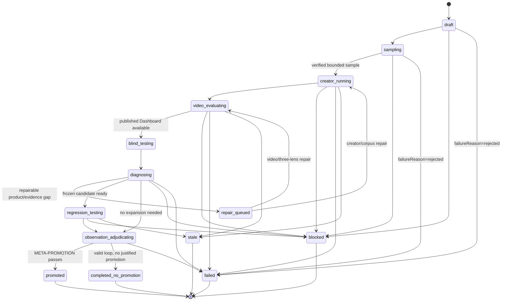
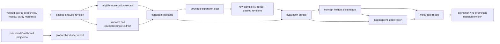

# Agent Learning Loop Contract

Status: **normative for learning-loop runtime, artifact lineage, evaluation, and promotion control**

This contract makes the research-learning model executable without allowing an agent to turn an attractive analysis into hidden prompt memory, an unverified identity into a creator fact, or an evaluation result into creation advice. It governs the loop around the versioned concept rules in [research-learning-model.md](research-learning-model.md), not a second concept model.

## 1. Conformance and vocabulary

A conforming implementation has one persisted `LearningLoopRun` for each attempt to learn from a completed research revision. It records the pinned subject/revision, contract version, ordered artifact DAG, role actions, gate results, stopping decision, failure classification, and terminal outcome. The run is reproducible from registered artifact IDs and hashes alone.

Terms used below:

- **candidate discovery** is a lead that may name an account, post, mechanism, or failure pattern. It is not verified identity or evidence.
- **verified identity** is a creator/post entity resolved under the two-anchor rule in [pipeline-and-gates.md](pipeline-and-gates.md) §5. A candidate must never be silently promoted to it.
- **observation** and **concept revision** retain the exact meanings and eligibility rules in [research-learning-model.md](research-learning-model.md).
- **old three fixtures** are AI红发魔女, 张咋啦, and 人类最强编导, with their non-loss assertions in [creator-depth-parity.md](creator-depth-parity.md).
- **new sample** is a post/creator not used to write or tune the candidate rule. **Untouched holdout** is a pre-registered new sample that no proposing, repair, or threshold-setting role may inspect until the candidate is frozen for evaluation.

## 2. Run state machine

`LearningLoopRun.state` is exactly one of the following states. State changes append an event; they do not overwrite history. `rejected` is never a state: it is a `failureReason` recorded on a `failed` run.



State meanings:

| State | Required persisted fact | Permitted terminal transition |
| --- | --- | --- |
| `draft` | requested source/revision and declared purpose | `sampling`, `blocked`, `failed` |
| `sampling` | candidate-versus-verified identity ledger, bounded sample rule, holdout registration | `creator_running`, `blocked`, `failed` |
| `creator_running` | existing creator collection/synthesis DAG is running on verified subjects | `video_evaluating`, `repair_queued`, `blocked`, `failed`, `stale` |
| `video_evaluating` | selected video artifacts pass/fail the existing three-lens runtime gates | `blind_testing`, `repair_queued`, `blocked`, `failed`, `stale` |
| `blind_testing` | product real-user blind test of the published Dashboard | `diagnosing`, `blocked`, `failed` |
| `diagnosing` | independent diagnosis joins product feedback, evidence gaps, and candidate/unknown extracts without changing their source artifacts | `repair_queued`, `regression_testing`, `observation_adjudicating`, `blocked`, `failed` |
| `repair_queued` | a bounded, classified repair is scheduled with fresh artifact fingerprint | `creator_running` or `video_evaluating`, `blocked`, `failed`, `stale` |
| `regression_testing` | old-three/new/untouched-holdout regression, including concept holdout blind test | `observation_adjudicating`, `blocked`, `failed`, `stale` |
| `observation_adjudicating` | independent judge and meta-gate decide the exact observation ledger and terminal result | `promoted`, `completed_no_promotion`, `failed`, `stale` |
| `promoted` | immutable `promote` concept revision is published and current pointer changes atomically | terminal |
| `completed_no_promotion` | valid completed run plus reason and retained candidate evidence | terminal |
| `failed` | unrecoverable classified failure; `failureReason=rejected` is used for rejected intake/source/identity | terminal |
| `blocked` | durable external action required; no unsafe retry | terminal until an explicit resume creates a new run attempt |
| `stale` | a pinned source, gate, or comparability dependency changed before a terminal decision | terminal; a fresh run may reuse valid artifacts |

`completed_no_promotion` is successful closure, not `failed`, `unknown`, or an implicit retry. It means the run completed its authorized inspection and evaluation, all reusable artifacts remain addressable, but no new promotion was justified. It must state one or more of `no_reusable_concept`, `insufficient_independent_support`, `condition_not_stable`, `contradiction_exceeds_limit`, `holdout_not_passed`, or `expansion_budget_reached`. It may create a candidate/qualification/contradiction revision where warranted, but must not change `currentRevisionId` to a higher scope.

## 3. Artifact envelope and allowed DAG

Every learning-loop artifact is immutable and registered before it is consumed. In addition to the common registry fields in [data-model.md](data-model.md) §4 and §8, its manifest contains:

```json
{
  "artifactId": "uuid",
  "kind": "learning.candidate-package",
  "sha256": "hex",
  "schemaVersion": "learning-loop-v1",
  "runId": "uuid",
  "subjectRevisionIds": ["uuid"],
  "inputArtifactIds": ["uuid"],
  "inputArtifactHashes": ["sha256"],
  "allowedInputArtifactIds": ["uuid"],
  "producerRole": "candidate_reviewer",
  "createdAt": "ISO-8601"
}
```

`allowedInputArtifactIds` is an allowlist resolved when the node is scheduled. `inputArtifactIds` must be a non-empty subset of it; their registered hashes must equal the manifest hashes. An agent cannot add an artifact, a browser-memory fact, prior conversation, free-text prompt recall, or a different run's output as an implicit input. A retry reuses exactly the same allowlist unless it is invalidated and a new node fingerprint is created.

The permitted artifact DAG is:



Allowed parents by artifact kind:

| Artifact kind | Only allowed inputs |
| --- | --- |
| `learning.eligible-observation-extract` | passed video/creator/comparison revision; its gate report; resolvable evidence artifacts |
| `learning.unknown-counterexample-extract` | pinned revision; its unknown/conflict records; gate report |
| `learning.candidate-package` | the two extracts; frozen concept definition/exclusions; no recommendations |
| `learning.expansion-plan` | candidate package; current denominator ledger; registered sampling policy |
| `learning.evaluation-bundle` | frozen candidate package; old-three regression artifacts; new-sample artifacts; untouched-holdout registration (not its contents before freeze) |
| `learning.product-blind-user-report` | published Dashboard projection only; its visible creator identity/performance is permitted, but no hidden candidate, evaluator verdict, or creation workspace material |
| `learning.concept-holdout-blind-report` | sanitized evaluation bundle only; no creator identity/profile, performance outcome, prior verdict, or creation workspace material |
| `learning.judge-report` | evaluation bundle; concept-holdout blind report; no candidate-producer hidden context |
| `learning.meta-gate-report` | evaluation bundle, concept-holdout blind report, judge report, deterministic gate results |
| `learning.decision-revision` | meta-gate report and exact eligible observation IDs only |

Any non-listed edge is a `lineage_violation` and fails the loop. Derived prose is never a substitute parent for the evidence artifact it summarizes.

## 4. Roles and read/write boundaries

Roles are capability boundaries, not merely prompt labels. A role may write only its listed immutable artifact kinds and may not alter an artifact or decision written by another role.

| Role | May read | May write | Must not do |
| --- | --- | --- | --- |
| `identity_resolver` | sanitized candidate links, snapshots | identity-resolution report | treat a discovery lead as verified identity; create concepts |
| `evidence_builder` | verified source/media, capture/gate outputs | extracts, evidence pack additions | infer promotion or alter identity |
| `candidate_reviewer` | eligible observations, unknowns, counterexamples | candidate package, expansion rationale | publish a concept, evaluate its own candidate, give creation advice |
| `sample_selector` | frozen candidate package, selection policy, coverage ledger | bounded expansion plan, holdout registration | inspect untouched-holdout contents; relabel a lead as verified identity |
| `reconstruction_runner` | scheduled verified samples only | normal analysis artifacts through existing DAG | consume candidate claims as facts; write learning decisions |
| `product_blind_user_agent` | published Dashboard, including the creator identity, public performance metrics, and visible evidence state | product blind-user report | see hidden candidate/holdout material, previous evaluator grades, or any creation brief; output creative/copying/publishing advice |
| `concept_holdout_blind_agent` | sanitized frozen evaluation bundle | concept holdout blind report | see creator identity/profile, observed performance, prior verdict, or any creation brief; output creative/copying/publishing advice |
| `independent_judge` | frozen candidate, evaluation bundle, concept holdout blind report | judge report, failure classifications | modify candidate definition, source artifacts, or selection policy |
| `meta_gate_runner` | deterministic gate inputs, concept holdout blind report, and judge report | meta-gate report | treat product feedback as concept evidence, invent evidence, waive a failed hard gate, or publish directly |
| `promotion_authorizer` | passed meta-gate report, exact observation ledger | immutable concept/decision revision | rewrite history or promote with incomplete gate bundle |

There are two deliberately different blind protocols:

- `product_blind_user_agent` is a real-user product test. It may see the already published Dashboard exactly as a user does, including creator identity, public performance values, and visible evidence state. It tests page comprehension, evidence navigation, disclosure of limitations, and whether the visible identity/performance context is honestly labeled. Its report is product feedback only and cannot create, confirm, qualify, contradict, or promote a concept.
- `concept_holdout_blind_agent` tests only three questions: (1) whether a normal reader can correctly understand the frozen observation and condition, (2) whether cited evidence supports or bounds it, and (3) what remains unknown. It receives only the sanitized evaluation bundle. Its schema is limited to `understanding`, `evidence_traceability`, `unknowns`, `ambiguities`, and `blocking_questions`.

Neither blind protocol may output a title, hook, script, shot, CTA, topic, positioning, imitation, or publishing suggestion. That is a `role_boundary_violation` and invalidates the affected report; product feedback and concept evidence remain separate.

## 5. Candidate discovery and identity boundary

Discovery output must use `identityState=candidate_unverified` and include source URL/locator, discovery timestamp, and ambiguity notes. It may enter sampling only as a lead. A creator/post becomes an analysis subject only after the existing two-anchor identity gate emits `identityState=verified` with a stable internal ID; `identity_ambiguous`, redirect-only, display-name-only, or one-anchor results stay outside denominator and promotion counts.

Candidate discovery may increase a queue but must not increase evidence support, creator count, video count, or holdout count. An unresolved candidate may be recorded as an unknown boundary, never a negative example or a missing observation.

## 6. Gates, judges, and meta-gate

Three kinds of check remain deliberately separate:

| Check | Owner | Question | Effect |
| --- | --- | --- | --- |
| `GATE-*` | deterministic validator | Is structure, lineage, identity, coverage, and policy valid? | hard pass/fail; no prose override |
| `JUDGE-*` | independent judge | Is the frozen claim understandable, evidence-bound, and fairly classified? | verdict with explicit failure classes; cannot publish |
| `META-*` | meta-gate runner | Do all required gates/verdicts and regression results jointly justify this terminal decision? | only route to promotion or completed-no-promotion |

Required runtime gates:

| Gate | Pass rule |
| --- | --- |
| `GATE-IDENTITY-VERIFIED` | every counted creator/post has a verified stable identity; candidates are excluded from denominators |
| `GATE-LINEAGE-ALLOWLIST` | all consumed IDs are in `allowedInputArtifactIds`; all hashes resolve and match |
| `GATE-OBSERVATION-ELIGIBILITY` | each counted observation is eligible under [research-learning-model.md](research-learning-model.md) §2 |
| `GATE-THREE-LENS-RUNTIME` | every video evidence unit used for a concept passes the relevant CR, DL, and VE gate and the overall AND gate in [three-lens-video-contract.md](three-lens-video-contract.md) §5; a passed transcript alone never qualifies |
| `GATE-ROLE-SEPARATION` | artifact producers/evaluator identities are distinct where required; the product blind report reads only the published Dashboard and the concept holdout blind report has only its sanitized allowlist |
| `GATE-HOLDOUT-SEALED` | concept holdout was registered before candidate freeze, was inaccessible to proposer/repair roles, and has a resolved result after freeze |
| `GATE-PRODUCT-BLIND-BOUNDARY` | product blind feedback is traceable to the published Dashboard and is excluded from concept observation counts and promotion evidence |
| `GATE-NO-CREATION-ADVICE` | all learning artifacts pass research/creation boundary checks |
| `GATE-REGRESSION-COVERAGE` | old three, new samples, and untouched holdout each have the required result/limitation record |

`JUDGE-UNDERSTANDING`, `JUDGE-EVIDENCE-BOUNDARY`, and `JUDGE-UNKNOWN-DISCIPLINE` are the minimum independent verdicts. A judge may return `pass`, `qualify`, or `fail`; `qualify` requires a narrowed machine-readable condition and re-evaluation, not a verbal exception.

`META-PROMOTION` passes only if every required `GATE-*` passes, all three judge verdicts are `pass` or an incorporated `qualify`, the appropriate quantitative threshold in [research-learning-model.md](research-learning-model.md) §5 passes, and the regression suite has no unclassified integrity or scope failure. Promotion remains an immutable `promote` revision; it never mutates a candidate in place.

## 7. Stopping and bounded expansion

Expansion exists to test a specific failed or under-powered decision condition, not to search indefinitely for confirmations. Every expansion plan fixes: hypothesis/revision, target population, sampling rule, maximum additional verified subjects, maximum rounds, required evidence channels, known confounds, and stopping reason.

Stop expansion and evaluate the current evidence when the first applicable condition occurs:

1. the relevant promotion threshold and holdout evaluation have passed;
2. the remaining eligible population is exhausted or every remaining item is identity-unverified/blocked;
3. the pre-declared maximum rounds or maximum additional verified subjects is reached;
4. three consecutive bounded rounds add zero eligible independent observations or only duplicate-video votes;
5. eligible contradictions make the claimed condition exceed its allowed contradiction rate and no narrower condition is justified;
6. a hard integrity, three-lens, or role-separation gate fails; or
7. a user/browser/platform blocker requires explicit handoff.

Cases 2–5 normally end `completed_no_promotion` unless existing evidence independently supports a lower-scope revision. Case 6 is `failed` with the relevant `failureReason` (including `rejected` when intake/source/identity is rejected); case 7 is `blocked`. Timeout, an empty result, a single failed page, or an unverified discovery lead is not evidence of absence and cannot by itself close expansion.

## 8. Failure classification and repair policy

Every failed gate/judge result is recorded with exactly one primary class and optional secondary classes:

| Class | Meaning | Required handling |
| --- | --- | --- |
| `identity_failure` | candidate cannot be resolved or anchors conflict | exclude from counts; retain as unknown lead |
| `rejected` | intake/source/identity is rejected under the declared contract before a valid evidence loop can continue | set run state `failed`; preserve the precise supporting failure class and artifact |
| `source_integrity_failure` | hash, media, mapping, or evidence reference is invalid | reject affected evidence; invalidate dependent eligibility |
| `three_lens_failure` | CR, DL, VE, or their AND readiness fails | quarantine observation; return only to normal video reconstruction closure |
| `lineage_violation` | unallowed, missing, or hash-mismatched input | reject run/node; do not repair by editing provenance |
| `coverage_failure` | denominator, sample, or required carrier coverage is insufficient | bounded expansion or completed-no-promotion |
| `scope_failure` | claim/condition is broader than evidence permits | qualify/demote or completed-no-promotion |
| `contradiction_failure` | valid counterexamples exceed threshold | disclose, qualify/demote, block promotion |
| `holdout_failure` | sealed holdout does not support understanding/evidence boundary | completed-no-promotion or narrower new candidate; no threshold tuning against that holdout |
| `role_boundary_violation` | a role read/wrote outside authority or blind agent gave advice | invalidate report and rerun with clean allowlist |
| `policy_or_handoff_blocker` | login, CAPTCHA, rate limit, or authorization boundary | block; require explicit human action |
| `non_reusable_finding` | evidence is valid but does not form a stable reusable concept | completed-no-promotion with retained observation/unknowns |

Repairs create new artifacts and a new node/run fingerprint. They never edit a failed artifact, erase a counterexample, or reuse a compromised holdout as a tuning sample.

## 9. Regression suite and decision record

Every promotion attempt and every `completed_no_promotion` after evaluation runs the same regression matrix:

| Cohort | Required use | Prohibition |
| --- | --- | --- |
| old three fixtures | prove historical migration/parity and detect cross-creator regression | do not use a fixture's historical prose as unpinned evidence |
| new samples | independently reproduce, qualify, or contradict the frozen candidate | do not select only supporting cases |
| untouched holdout | final blinded check of understanding, evidence traceability, and unknown discipline | do not expose it before candidate freeze or use it to tune thresholds/wording |

The regression artifact records cohort membership, every artifact ID/hash, identity state, relevant three-lens results, eligible/ignored observation reason, judge result, and failure class. The old-three parity suites must still pass their original count and non-loss contracts; regression success never permits changing their denominators.

The final decision record includes: run ID; exact candidate revision; input/allowlist fingerprints; observed and eligible denominators; all support/qualify/contradict IDs; old-three/new/holdout results; every gate and judge verdict; stop reason; failure classifications; and one terminal outcome. This record is required whether the outcome is `promoted`, `completed_no_promotion`, `failed`, `blocked`, or `stale`.

## 10. Non-goals

This loop learns auditable research distinctions. It does not output a creative strategy, account positioning, reference selection, title, cover, script, shot list, CTA, experiment, or publishing plan. Such material belongs to a separately authorized Creation Workspace and is not an allowed artifact input or output of this contract.
