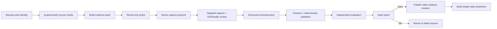
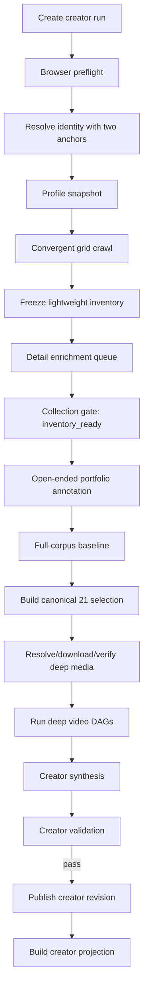

# Creator Analysis OS V1 — Workflow, Jobs, and Gates

Status: **proposed orchestration contract**

## 1. Workflow principle

Every research request becomes a persisted DAG. Web requests create or query work; they never hold an authenticated browser or a multi-minute reconstruction process open.

Workers are at-least-once. Outputs are idempotent because each job has an input fingerprint and writes immutable artifacts before publishing state.

## 2. Durable job contract

Each `jobs` row contains:

- `id`, `run_id`, `node_id`, `kind`, `subject_type`, `subject_id`;
- `status`: `queued | leased | running | needs_user | backoff | succeeded | failed | canceled | stale`;
- `idempotency_key` and input fingerprint;
- priority and required worker capability;
- attempt count, maximum attempts, and `next_run_at`;
- lease owner, lease expiry, and heartbeat time;
- safe parameters and expected output artifact kinds;
- failure class and last error summary.

A worker claims a job with a lease. If it disappears, the lease expires and the same idempotent job can resume or retry. Partial unregistered output is never authoritative.

## 3. Worker capabilities

| Capability | Responsibility | Default concurrency |
| --- | --- | ---: |
| `browser.xhs.read` | identity, grid, details, public comments, safe media candidates | 1 per TaskSpace |
| `media.resolve` | transient URL handling and downloads | 1–2 |
| `media.verify` | container/timeline/continuity checks | 2 |
| `video.reconstruct` | evidence pack through reconstruction | 1–3 |
| `video.evaluate` | independent audit/evaluation closure | isolated from runner context |
| `portfolio.analyze` | annotations, baseline, selection, creator synthesis | 1–2 |
| `comparison.analyze` | pinned cross-creator normalization and synthesis | 1–2 |
| `projection.build` | rebuild frontend read models | 2 |

The reconstruction evaluator must not reuse the runner's hidden working context or prior human report.

## 4. Single-video DAG

### Video readiness

`ready` requires:

- source media state is accepted for reconstruction;
- full timeline carrier sweep exists;
- every available carrier is checked or explicitly unavailable;
- core knowledge evidence coverage ≥ 0.90;
- critical-question recall ≥ 0.85;
- unsupported positive inference ≤ 0.05;
- timestamp accuracy ≥ 0.90;
- applicable procedure dependency coverage ≥ 0.85;
- unknown discipline ≥ 0.90;
- meta-gate passes;
- human-readable article is generated from the validated reconstruction revision.

A readable article cannot override a failed hard gate.

## 5. Single-creator DAG

### Collection convergence

Crawl stops only on:

- explicit end marker;
- three consecutive zero-growth rounds;
- declared operator budget reached, producing `partial` rather than `complete`.

Timeout, empty shell, redirect, challenge, or extraction error is never convergence.

### Creator gates

Portfolio computation may start only when:

- creator identity has two consistent anchors;
- crawl stop reason and denominator are recorded;
- merged duplicate post IDs are zero;
- post media type is explicit or counted unresolved;
- public metric missingness is measured;
- snapshot time and timezone are recorded.

Mechanism synthesis may publish only when:

- full-corpus statistics reproduce from the pinned corpus revision;
- the canonical selection set records tier rules, anchors, reasons, confounds, and denominator;
- Base contains explicit median/mean semantics or a declared mean gap;
- deep records expose reconstruction/evaluation state;
- claims that rely on deep content cite only validated reconstructions;
- unknown backend metrics remain unknown;
- no creation recommendation is present in the research artifact.

## 6. Multi-creator DAG

```mermaid
flowchart LR
    M0[Create comparison project] --> M1[Resolve members]
    M1 --> M2[Pin creator revisions]
    M2 --> M3[Comparability audit]
    M3 --> M4[Full-history + aligned-window metrics]
    M4 --> M5[Normalize within creator]
    M5 --> M6[Build value/topic/format matrices]
    M6 --> M7[High/Base/Low mechanism comparison]
    M7 --> M8[Classify conclusion ledger]
    M8 --> M9[Evidence closure]
    M9 --> M10[Publish comparison revision]
    M10 --> M11[Build multi-creator projection]
```

### Comparison gates

- Every member pins one creator-analysis revision and metric cutoff.
- Platform, timezone, aligned window, exclusions, and special-case roles are explicit.
- Raw and creator-relative metrics are both available.
- A `track_wide` conclusion cites more than one creator and more than one underlying record.
- `creator_specific` does not masquerade as a track rule.
- Conditional findings name the condition.
- An anomaly remains an anomaly unless repeated evidence changes its class.
- Every aggregate conclusion drills down to creator/post/video evidence.
- Under-covered sample areas are observations, not creation recommendations.

## 7. Browser safety and human handoff

The browser worker exposes only high-level allowlisted commands:

1. verify session;
2. open/confirm creator;
3. collect one bounded read-only observation;
4. release TaskSpace.

Read-only policy denies likes, comments, follows, publishing, credential access, cookie reads, and arbitrary page mutation.

Stop signals become durable blockers:

- `login_required`;
- `captcha_required`;
- `rate_limited`;
- `identity_ambiguous`;
- `page_shape_unknown`;
- `user_took_control`.

`captcha_required` and login handoff are `needs_user`; the system does not switch browsers, rotate identity, spoof fingerprints, or retry aggressively.

## 8. Backoff and acquisition efficiency

- Cache profile/detail observations by entity revision and TTL.
- Inventory first; do not open every detail page before coverage is known.
- Enrich only missing, stale, comparison, or deep records.
- Download media only for the deep set unless explicitly expanded.
- Run one Xiaohongshu detail page at a time in natural reading order.
- Use bounded batches and stop on platform warnings.
- Track reuse, refreshed, downloaded, missing, and failed counts.
- Never add random “human-like” behavior intended to evade detection; efficiency comes from fewer legitimate reads and resumability.

## 9. Media verification gate

Before reconstruction, verify:

1. transport and checksum;
2. container, codec, duration, and decode errors;
3. timeline probes at start, quartiles, near-end, and dense tail;
4. moving-content continuity and frozen/black/repeated tails.

Accepted states:

- `verified_complete`;
- `verified_visual_short_no_subtitle` with documented handling.

Rejected/blocking states:

- `partial_or_frozen_tail`;
- `decode_failed`;
- `metadata_mismatch`;
- `unknown_completeness`.

## 10. Invalidation matrix

| Upstream change | Recompute | Preserve |
| --- | --- | --- |
| likes/collections/comments/shares snapshot | corpus stats, tiers if thresholds shift, creator projection, comparisons | media reconstruction if media hash unchanged |
| title/copy/cover changed | annotations, selection reasoning, creator/comparison synthesis | reconstruction unless video input changed |
| media hash changed | evidence pack onward, dependent creator/comparison claims | older revision remains historical |
| transcript/subtitle changed | reconstruction onward | raw media artifact |
| annotation rules/version changed | annotations, corpus clusters, selection, creator/comparison | raw snapshots and reconstruction evidence |
| tier rule changed | selection, creator synthesis, comparisons | corpus snapshots and reconstructions |
| reconstruction contract/skill changed | selected reconstruction and dependent claims | acquisition/media artifacts |
| creator revision changed | dependent comparison becomes stale | pinned prior comparison remains reproducible |
| projection template changed | projection only | all research artifacts |

Invalidation marks downstream nodes `stale_available`; it does not delete old valid revisions.

## 11. Readiness vocabulary

Use separate operational and evidence states.

### Operational status

`queued | running | needs_user | backoff | blocked | failed | canceled | succeeded`

### Research readiness

- `workflow_validated` — fixtures prove compatibility only;
- `partial` — usable evidence exists with named gaps;
- `reviewable` — real evidence and projections exist but required gates/review remain;
- `ready` — all object-specific hard gates pass;
- `stale_available` — a prior ready revision is visible but a newer dependency exists;
- `retired` — no longer current but retained for audit.

Do not use one overloaded `complete` value for both.

## 12. Observability

Every job event records:

- run/node/job IDs;
- safe subject ID;
- attempt, elapsed time, and worker capability;
- input/output artifact IDs;
- extraction strategy or tool version;
- retry/failure class;
- redaction state;
- lease and handoff transitions.

Logs must never include credentials, request headers, cookies, local browser profiles, or signed download URLs.
