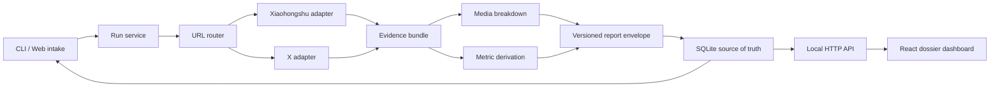

# Link Analysis Dashboard — Design

## Architecture

## Technology choices

- TypeScript on Node 22 for the core, API, CLI, and shared schemas.
- Vite + React for the local Web dashboard.
- Express for the local API and production static serving.
- SQLite through Node's built-in `node:sqlite` module; no native addon.
- Zod at every external JSON boundary.
- FFmpeg/FFprobe for media evidence.
- Existing Xiaohongshu Python CLI and twitterapi.io adapter remain external
  boundaries. Secrets are read only from environment/configured external files.

## Module boundaries

### Core

Owns URL routing, run lifecycle, report schema, metric derivation, evidence
classification, and persistence contracts. It refuses platform login and UI.

### Platform adapters

Translate one external provider into the neutral evidence bundle. They may
return `ready`, `partial`, or `blocked`; they may not fabricate absent fields.

### Media analyzer

Owns FFprobe metadata, representative frames/contact sheet, optional transcript
command invocation, and stage evidence. It refuses editorial conclusions.

### Report engine

Turns evidence into deterministic baseline findings. Future model-based
analysis can enrich the same envelope, but must preserve provenance and
confidence.

### Dashboard

Read model and operator controls only. It does not own hidden business rules or
duplicate report logic.

## Canonical report envelope

The report envelope is the stable interface shared by SQLite, API, CLI, and UI:

- identity: schema version, run ID, source URL, platform, timestamps;
- lifecycle: status, current stage, stage records, retryable failures;
- source: author, title/text, media, public metrics, raw evidence references;
- breakdown: transcript segments, shots, frames, structural beats;
- analysis: facts, observations, inferences, confidence, limitations;
- actions: reusable patterns, avoid-list, hook rewrites, next experiments.

Raw provider responses and generated media live under ignored runtime storage;
SQLite stores normalized fields and JSON envelopes, never secrets.

## Platform integration

### Xiaohongshu

Parse `feed_id` and `xsec_token` from supported URLs and invoke only the
installed `xiaohongshu-skills/scripts/cli.py get-feed-detail` command. A link
without the token remains a visible blocked run rather than triggering an
unbounded search or bypass.

### X/Twitter

Parse the status/tweet ID and call the read-only twitterapi.io endpoint used by
the existing `twitter-mcp`. The API key is read from `TWITTER_API_KEY` or the
existing external skill `.env` without copying it into this project.

## UI doctrine

The product is an evidence dossier, not a BI card grid. Desktop uses a narrow
run queue beside a dominant report surface. The detail surface orders content
as: source and evidence quality, conclusion, timeline/script, metrics,
limitations, reusable actions. Mobile keeps conclusion and evidence quality
before dense tables.

## Failure model

Every stage produces one of `pending`, `running`, `complete`, `partial`,
`blocked`, or `failed`. The run can be useful when a stage is partial. Error
messages include a human next action and never contain secrets.

## Validation strategy

- Unit: URL parser, normalized metrics, report engine, schema round-trip.
- API: create/list/read/retry flows with deterministic fixture adapters.
- CLI: fixture analysis creates a persisted run and JSON report.
- Browser: intake form, queue navigation, detail route, empty/error states,
  responsive layout, and console check.

## Durable decision

The versioned report envelope and SQLite are canonical. Dashboard and Notion
are read/sync surfaces. This decision is recorded in ADR-0001.

