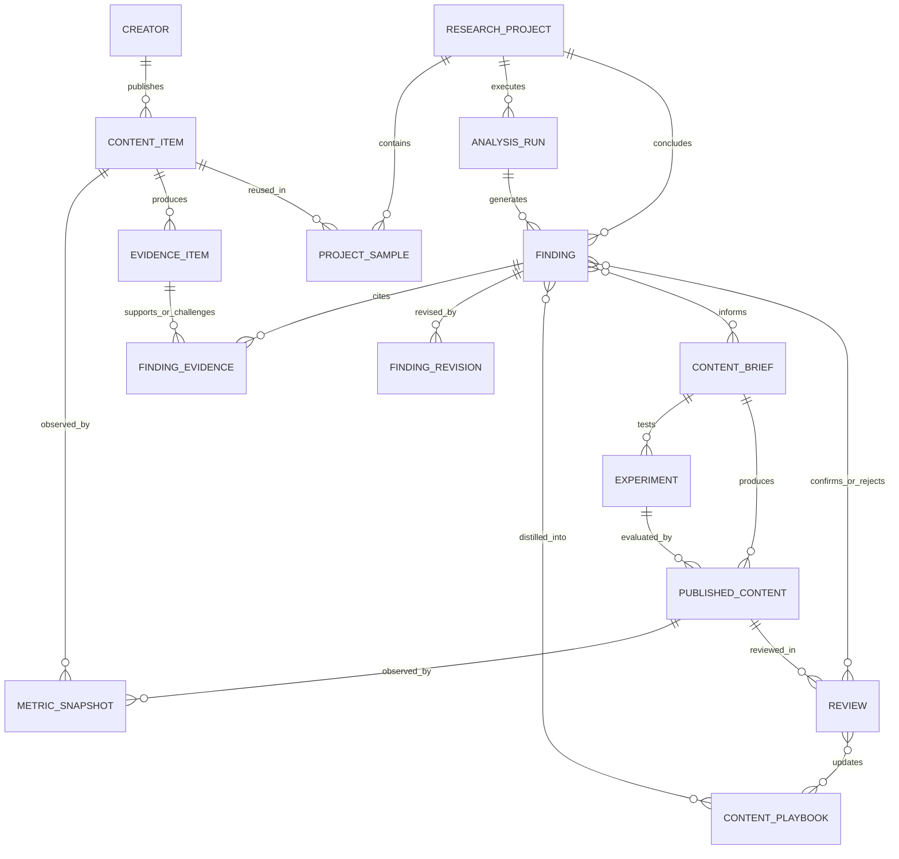

# Signal Room V3 — 数据模型规范

## 1. 模型目标

V3 数据模型必须同时支持三种分析和一条学习闭环：

- 同一帖子可被单帖、专题和博主项目复用；
- 公开事实、账号后台指标和 AI 推断不会混写；
- 一次研究可重复采集和重算，但项目本身长期存在；
- 任意结论可以追溯到支持证据、反证、替代解释和计算过程；
- 内容模型、Brief、实验、发布内容和复盘能回到原始研究。

## 2. 聚合与所有权

| 聚合 | 根实体 | 拥有的数据 | 不拥有的数据 |
| --- | --- | --- | --- |
| 内容资料 | Creator / ContentItem | 内容身份、原文、媒体引用、指标快照 | 研究中的分组和判断 |
| 研究项目 | ResearchProject | 研究问题、目标、样本角色、运行、结论 | 原始内容实体 |
| 内容方法 | ContentPlaybook | 已确认模式、适用范围、依赖、反例 | 原始证据副本 |
| 制作实验 | ContentBrief / Experiment | 创作方案、变量、验收标准 | 平台原始帖子数据 |
| 发布复盘 | PublishedContent / Review | 发布版本、指标快照、结论修订 | 旧指标覆盖值 |

## 3. 关系图

## 4. 枚举规范

### ProjectType

`single_post | series_topic | creator`

### Objective

`awareness | growth | authority | conversion`

### FindingType

`fact | observation | hypothesis | unknown`

### FindingEvidenceRelation

`supports | contradicts | alternative | calculation_input`

### SourceTier

`public | comparative | owner | manual`

### ReviewStatus

`machine_draft | human_confirmed | human_revised | rejected`

### ProjectStatus

`inbox | scoping | collecting | analyzing | ready | needs_data | archived`

## 5. 实体字段

### 5.1 Creator

| 字段 | 类型 | 约束／说明 |
| --- | --- | --- |
| id | UUID | 主键 |
| platform | enum | 平台 |
| externalId | string | 平台作者 ID；与 platform 联合唯一 |
| handle | string? | 可变化 |
| name | string | 最近一次已知昵称 |
| profileUrl | URL | 规范化主页链接 |
| avatarArtifactRef | string? | 本地或缓存引用 |
| firstSeenAt | datetime | 首次采集时间 |
| lastCollectedAt | datetime? | 最近采集时间 |

### 5.2 CreatorSnapshot

用于保存会变化的主页事实，避免覆盖历史。

| 字段 | 类型 | 说明 |
| --- | --- | --- |
| id | UUID | 主键 |
| creatorId | UUID | 外键 |
| observedAt | datetime | 观察时间 |
| followers | number? | 平台可得时 |
| totalLikesAndBookmarks | number? | 仅在来源明确时 |
| bio | string? | 主页简介 |
| rawArtifactRef | string? | 原始来源 |
| verificationStatus | enum | verified / unverified / stale |

### 5.3 ContentItem

| 字段 | 类型 | 说明 |
| --- | --- | --- |
| id | UUID | 主键 |
| platform | enum | 平台 |
| externalId | string | 与 platform 联合唯一 |
| creatorId | UUID? | 作者未解析时允许为空 |
| contentType | enum | video / image_note / text / thread / unknown |
| sourceUrl | URL | 规范化原始链接 |
| title | string | 原始标题 |
| body | text | 原始正文 |
| tagsJson | JSON | 原始标签数组 |
| publishedAt | datetime? | 未知时为空 |
| firstSeenAt | datetime | 首次采集时间 |
| latestSourceArtifactRef | string? | 最近原始快照 |

### 5.4 MetricSnapshot

| 字段 | 类型 | 说明 |
| --- | --- | --- |
| id | UUID | 主键 |
| subjectType | enum | content_item / creator / published_content |
| subjectId | UUID | 对应对象 |
| sourceTier | enum | public / owner |
| observedAt | datetime | 快照时间 |
| contentAgeHours | number? | 便于观察窗口校准 |
| views | number? | 缺失保持 null |
| likes | number? | 缺失保持 null |
| comments | number? | 缺失保持 null |
| shares | number? | 缺失保持 null |
| bookmarks | number? | 缺失保持 null |
| quotes | number? | 缺失保持 null |
| followersGained | number? | owner 层 |
| profileVisits | number? | owner 层 |
| leads | number? | owner 层 |
| conversions | number? | owner 层 |
| cost | number? | owner 层 |
| rawArtifactRef | string? | 导入或采集证据 |

唯一约束建议：`subjectType + subjectId + sourceTier + observedAt`。

### 5.5 EvidenceItem

| 字段 | 类型 | 说明 |
| --- | --- | --- |
| id | UUID | 主键 |
| contentItemId | UUID? | 证据对应帖子 |
| creatorId | UUID? | 证据对应博主 |
| evidenceType | enum | text / metric / comment / transcript / frame / shot / profile / calculation / manual_note |
| sourceTier | enum | public / comparative / owner / manual |
| locator | string | 字段路径、时间码、评论 ID 等 |
| excerpt | text? | 合规的短摘录或结构化摘要 |
| artifactRef | string? | 原始文件引用 |
| checksum | string? | 证据版本检查 |
| observedAt | datetime | 观察时间 |

### 5.6 ResearchProject

| 字段 | 类型 | 说明 |
| --- | --- | --- |
| id | UUID | 主键 |
| projectType | enum | 三种分析模式 |
| title | string | 人类可识别名称 |
| researchQuestion | text | 页面首要问题 |
| objective | enum | 运营目标 |
| platformScopeJson | JSON | 一个或多个平台 |
| observationWindowJson | JSON | 统一观察窗口 |
| comparabilityRulesJson | JSON | 体量、形式、投流等规则 |
| status | enum | 用户项目状态 |
| ownerId | string? | 本地单用户阶段可为空 |
| createdAt | datetime | 创建时间 |
| updatedAt | datetime | 更新时间 |

### 5.7 ProjectSample

| 字段 | 类型 | 说明 |
| --- | --- | --- |
| id | UUID | 主键 |
| projectId | UUID | 外键 |
| contentItemId | UUID | 外键 |
| role | enum | subject / author_baseline / topic_peer / manual_reference / candidate |
| cohort | enum | winner / middle / underperformer / unassigned |
| inclusionReason | text | 纳入原因 |
| exclusionReason | text? | 排除原因 |
| included | boolean | 当前是否参与计算 |
| addedAt | datetime | 添加时间 |

唯一约束：`projectId + contentItemId`。

### 5.8 AnalysisRun

| 字段 | 类型 | 说明 |
| --- | --- | --- |
| id | UUID | 主键；可复用现有 Run ID |
| projectId | UUID | 外键 |
| runType | enum | collect / media_breakdown / single_analysis / cohort_analysis / creator_analysis / review_update |
| status | enum | queued / running / complete / partial / blocked / failed |
| schemaVersion | string | 输出契约版本 |
| inputFingerprint | string | 输入与规则指纹，避免无意义重算 |
| modelVersion | string? | AI 或分析模型版本 |
| startedAt | datetime? | 开始时间 |
| finishedAt | datetime? | 结束时间 |
| reportArtifactRef | string? | 版本化结果 |

### 5.9 Finding

| 字段 | 类型 | 说明 |
| --- | --- | --- |
| id | UUID | 主键 |
| projectId | UUID | 外键 |
| analysisRunId | UUID? | 来源运行 |
| findingType | enum | fact / observation / hypothesis / unknown |
| dimension | string | audience / hook / visual / performance 等 |
| statement | text | 单一、可审计判断 |
| confidence | enum | high / medium / low |
| scope | text | 适用范围和前提 |
| reviewStatus | enum | 机器草稿到人工否定 |
| createdAt | datetime | 创建时间 |
| supersededById | UUID? | 被新结论替代时保留链路 |

### 5.10 FindingEvidence

| 字段 | 类型 | 说明 |
| --- | --- | --- |
| findingId | UUID | 联合主键 |
| evidenceItemId | UUID | 联合主键 |
| relation | enum | supports / contradicts / alternative / calculation_input |
| weight | number? | 可选权重，不代表概率 |
| note | text? | 为什么构成该关系 |

### 5.11 FindingRevision

| 字段 | 类型 | 说明 |
| --- | --- | --- |
| id | UUID | 主键 |
| findingId | UUID | 外键 |
| previousStatement | text | 修改前 |
| nextStatement | text | 修改后 |
| previousStatus | enum | 修改前状态 |
| nextStatus | enum | 修改后状态 |
| reason | text | 人工理由或复盘结果 |
| revisedAt | datetime | 修改时间 |

### 5.12 ContentPlaybook

| 字段 | 类型 | 说明 |
| --- | --- | --- |
| id | UUID | 主键 |
| playbookType | enum | winning_pattern / failure_pattern / script_archetype / visual_grammar / platform_rule |
| title | string | 名称 |
| statement | text | 方法内容 |
| applicability | text | 适用平台、人群和形式 |
| dependenciesJson | JSON | 身份、资源、制作能力等依赖 |
| counterExamplesJson | JSON | 已知反例引用 |
| status | enum | draft / confirmed / validated / retired |
| updatedAt | datetime | 更新时间 |

Finding 与 Playbook 通过中间表 `playbook_findings(playbookId, findingId, relation)` 关联。

### 5.13 ContentBrief

| 字段 | 类型 | 说明 |
| --- | --- | --- |
| id | UUID | 主键 |
| title | string | 选题名 |
| targetAudience | text | 目标人群 |
| audienceJob | text | 用户任务 |
| promise | text | 内容承诺 |
| structureJson | JSON | 脚本／图文结构 |
| visualPlanJson | JSON | 画面、证据和素材计划 |
| invariantsJson | JSON | 必须保留变量 |
| testVariablesJson | JSON | 可测试变量 |
| risksJson | JSON | 风险与不可照搬条件 |
| status | enum | draft / approved / producing / published / archived |

Brief 与 Finding 通过 `brief_findings(briefId, findingId, relation)` 关联。

### 5.14 Experiment / PublishedContent / Review

Experiment 保存假设、目标、A/B 或连续内容变量、主要指标、守护指标、成功标准、最少样本和数据可得性。

PublishedContent 保存 Brief／Experiment 关联、平台、外部内容 ID、链接、实际版本和发布时间。

Review 保存评价窗口、结果摘要、原假设状态变化、证据引用和下一步动作。复盘不得直接覆盖原 Finding，而是新增修订或替代关系。

## 6. 关键不变量

1. 内容、博主和发布内容使用稳定 ID；昵称、标题和指标变化不会创建重复实体。
2. 指标只追加快照，禁止覆盖历史。
3. 缺失指标为 `null`，未知判断为 `unknown`，二者都不等于零或弱。
4. Finding 必须至少有一个 EvidenceItem，唯有 `unknown` 可以只关联“缺失数据说明”证据。
5. Observation 和 Hypothesis 不得自动升级为 Fact。
6. 反证和替代解释与支持证据具有同等可见性。
7. AI 重新分析产生新 Run 和新 Finding 版本，不静默改写人工确认结论。
8. 同一帖子在多个项目中只存一份事实数据，但项目角色、分组和解释彼此独立。
9. 账号后台指标默认本地保存，不能自动同步 Notion。
10. 旧 V2 报告迁移后仍保留原始 JSON，任何字段映射都可回溯。

## 7. 现有 V2 到 V3 的映射

| 现有字段／对象 | V3 目标 |
| --- | --- |
| `runs` 行 | AnalysisRun；首次打开时创建 ResearchProject |
| `source.author` | Creator + CreatorSnapshot |
| `source` | ContentItem + 最新公开 MetricSnapshot |
| `source.comments` | EvidenceItem(comment) |
| `mediaBreakdown.shots` | EvidenceItem(shot/frame/transcript) |
| `context.authorPosts` | ProjectSample(author_baseline) + ContentItem |
| `context.topicPosts` | ProjectSample(topic_peer) + ContentItem |
| `findings` / `causalModel` | Finding + FindingEvidence，默认 machine_draft |
| `replication` | ContentPlaybook 草稿或 ContentBrief 输入 |
| `experiments` | Experiment 草稿 |
| `creatorAnalysis` | 旧版博主摘要 Finding，不视为完整博主项目 |

## 8. 存储阶段建议

### 第一阶段：本地 SQLite

沿用本地优先架构，将新实体拆为规范化表；大体量转录、帧图和原始 Payload 仍保存在 artifacts 目录，数据库只存引用和校验值。

### 第二阶段：多人协作可选

如果需要多用户或远程协作，再将相同实体迁移至 PostgreSQL，并补充 workspace、member、权限和行级访问控制。V3 MVP 不提前引入远程数据库复杂度。

