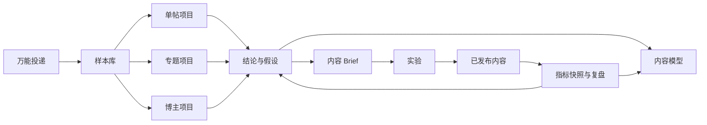
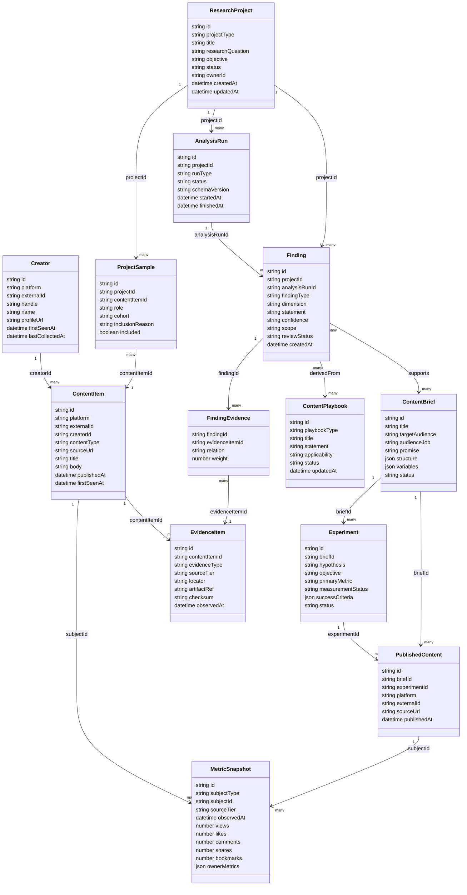

# Signal Room V3 — 产品与系统设计

## 1. 设计结论

V3 的核心对象从 `Run / Report` 改为 `ResearchProject`。Run 仍然存在，但只负责可重试的采集、拉片和分析执行；用户看到和维护的是一个长期研究项目。



## 2. 领域边界

### 2.1 采集执行层

负责平台适配、登录状态、公开数据采集、媒体解析、转录和计算。现有 `runs` 与 `ReportEnvelope` 继续作为执行记录和兼容载体。

### 2.2 内容资料层

负责去重后的帖子、博主、媒体、评论、公开指标快照和用户导入的账号后台指标。资料层只保存事实或原始证据，不保存未经标记的推断。

### 2.3 研究层

负责研究问题、运营目标、样本集合、分组、可比性规则、结论、反例、未知和修订历史。三种分析模式共享证据语言，但拥有不同分析视图。

### 2.4 行动与学习层

负责内容模型、Brief、实验、发布内容、指标回填和复盘。它把“读报告”改成“形成动作并验证”。

### 2.5 协作同步层

负责把经过用户确认的摘要同步到 Notion。Notion 页面保存人类可读内容和本地深度报告链接，不接管原始运行数据。

## 3. 核心数据模型

### 3.1 关系总览



### 3.2 实体职责与关键约束

#### Creator

- 唯一键：`platform + externalId`。
- 主页昵称、粉丝数、简介等可变化字段通过资料快照或最近采集值维护。
- 不把“30.9 万赞与收藏”等分享文案字段直接写成当前事实；它需要来源、观察时间和验证状态。

#### ContentItem

- 唯一键：`platform + externalId`；同一帖子可参与多个项目。
- `contentType` 支持 `video`、`image_note`、`text`、`thread`、`unknown`。
- 标题、正文和标签属于内容事实；脚本功能、受众任务等属于分析结果。

#### MetricSnapshot

- 所有指标采用追加快照，不覆盖旧值。
- `sourceTier` 为 `public` 或 `owner`；后台指标不能与公开指标混在同一来源层。
- 不同平台缺失的指标保存为 `null`，不得保存为 `0`。
- 派生速度、比例和提升值在分析输出中计算，并记录公式与观察窗口。

#### EvidenceItem

- `evidenceType`：`source_text`、`metric_snapshot`、`comment`、`transcript`、`frame`、`shot`、`profile`、`calculation`、`manual_note`。
- `locator` 保存页内定位信息，例如评论 ID、`00:13.2–00:16.8` 或字段路径。
- `checksum` 用于判断原始证据是否变化；`artifactRef` 指向现有本地证据文件。

#### ResearchProject

- `projectType`：`single_post`、`series_topic`、`creator`。
- `objective`：`awareness`、`growth`、`authority`、`conversion`。
- 项目状态服务用户：`inbox`、`scoping`、`collecting`、`analyzing`、`ready`、`needs_data`、`archived`。
- 技术运行状态只在诊断面板出现，不取代项目状态。

#### ProjectSample

- `role`：`subject`、`author_baseline`、`topic_peer`、`manual_reference`、`candidate`。
- `cohort`：`winner`、`middle`、`underperformer`、`unassigned`。
- 保存纳入／排除原因，保证多帖结论可审计。

#### AnalysisRun

- 新 Run 关联 Project，而不是 Project 等同于 Run。
- 支持 `collect`、`media_breakdown`、`single_analysis`、`cohort_analysis`、`creator_analysis`、`review_update`。
- 保留 `schemaVersion`，旧 V2 报告可作为一次历史 Run 挂入迁移后的单帖项目。

#### Finding

- `findingType`：`fact`、`observation`、`hypothesis`、`unknown`。
- `reviewStatus`：`machine_draft`、`human_confirmed`、`human_revised`、`rejected`。
- `scope` 描述适用条件，例如“仅适用于小红书、知识口播、近 30 日样本”。
- Finding 不内嵌大段证据，通过 FindingEvidence 关联支持、反证与替代解释。

#### ContentPlaybook

- `playbookType`：`winning_pattern`、`failure_pattern`、`script_archetype`、`visual_grammar`、`platform_rule`。
- 只有用户确认或被发布复盘验证的 Finding 才能升级为 `validated`。
- 同一模型保存适用范围、依赖资源和已知反例，避免“爆款公式”绝对化。

#### ContentBrief / Experiment / PublishedContent

- Brief 保存目标人群、用户任务、承诺、脚本结构、画面结构和证据计划。
- Experiment 必须声明主要指标、守护指标、成功标准和数据可得性。
- PublishedContent 关联实际发布版本；一个 Brief 可以跨平台产生多个发布内容。

## 4. 三种分析模型

### 4.1 单帖模型

输入：目标帖子、作者基线、题材基线、媒体证据、公开评论和可选后台数据。

输出结构：

```text
研究问题
  ├─ 目标与数据边界
  ├─ 相对表现位置
  ├─ 内容 X-Ray
  │   ├─ 人群与用户任务
  │   ├─ 承诺与钩子
  │   ├─ 脚本功能段
  │   ├─ 画面与证据
  │   └─ CTA 与评论响应
  ├─ 机制假设 / 反证 / 替代解释
  └─ 可复用结构 / 风险 / 下一条实验
```

### 4.2 专题模型

输入：样本集合、运营目标、观察窗口、分组规则和可比性规则。

处理顺序：

1. 数据完整性与可比性检查；
2. 按目标建立表现指标，不计算跨目标总分；
3. 将样本分为 winner / middle / underperformer；
4. 提取统一维度；
5. 比较分组差异并寻找反例；
6. 输出区分因素、非区分因素、混杂因素和内容空位。

每个“区分因素”至少包含：维度、方向、组内覆盖率、代表帖子、反例、置信度、适用范围和缺失数据。

### 4.3 博主模型

输入：主页快照、至少 12 条内容、多个时间段、作者公开指标和评论样本。

输出由五层组成：

1. **服务对象**：受众分群、用户任务、痛点和愿望；
2. **内容系统**：账号承诺、内容支柱、形式和系列；
3. **表达系统**：标题封面、视觉语法、脚本母版和证据方式；
4. **表现系统**：稳定性、爆款依赖、异常、节奏和长尾；
5. **起号决策**：可复制能力、账号依赖、资源依赖和差异化方向。

## 5. 页面与交互设计

### 5.1 共享项目外壳

- 左侧 72px 工作区导航，默认只显示图标和状态；需要时展开为 224px。
- 顶部为万能投递和项目切换，不再使用大面积品牌抬头。
- 主画布按研究模式变化；桌面端右侧固定 336px 证据检查器。
- Finding 使用统一视觉标记：事实绿、观察墨色、假设橙、未知灰、风险红。
- 点击任何聚合结论时，证据检查器显示来源、样本、公式、反例和原始定位。

### 5.2 单帖研究台

- 首屏：研究问题、目标、相对位置和下一步动作。
- 中段：视频／封面与脚本时间轴并排，按功能段而非机械等分呈现。
- 下段：机制链、评论需求和可复用方案；密集原始数据通过右侧证据栏查看。

### 5.3 专题对照台

- 顶部常驻样本定义和可比性警告。
- 主画布先显示赢家／中位／低表现的分布，再显示维度矩阵。
- 用户可点击维度，把样本卡片按支持、反例、未知筛选。
- 结论区必须区分“区分因素”和“常见但无区分力因素”。

### 5.4 博主研究台

- 首屏为“受众 → 承诺 → 内容支柱 → 内容形式 → 结果”的账号操作系统。
- 支柱矩阵同时展示占比、表现、稳定性和代表内容。
- 视觉语法与脚本母版用可浏览样本墙呈现，不能只用文字关键词。
- 起号建议放在证据之后，区分可复制、依赖和差异化。

## 6. 视觉规格

### 6.1 方向

Industrial / utilitarian evidence lab。延续纸张、墨色、细分隔线和编辑部编号，但取消海报式巨型标题、重复大卡片和纯装饰留白。

### 6.2 色彩

| Token | Hex | 用途 |
| --- | --- | --- |
| `paper` | `#F4F1E8` | 页面底色 |
| `ink` | `#171713` | 主要文字、重要结论 |
| `line` | `#D7D1C4` | 结构线、表格分隔 |
| `verified` | `#2F6B4F` | 事实、已验证、正向状态 |
| `hypothesis` | `#C86B3C` | 假设、待验证机制 |
| `risk` | `#A94A3F` | 风险、反证、阻塞 |
| `muted` | `#77746C` | 辅助信息、未知 |

### 6.3 字体与尺度

- 标题／标签：IBM Plex Sans Condensed；中文回退 Noto Sans CJK SC。
- 数据／状态／证据编号：IBM Plex Mono。
- 项目标题 30–34px；区块标题 20–24px；正文 14–16px／1.55；核心指标 28–36px。
- 同一屏幕最多一个超出 32px 的文字对象。

### 6.4 响应式

| 宽度 | 布局 |
| --- | --- |
| `>= 1280px` | 72px 导航 + 主画布 + 336px 证据栏 |
| `1024–1279px` | 56px 导航 + 主画布；证据栏可折叠 |
| `768–1023px` | 顶部导航 + 单列主画布；证据抽屉 |
| `< 768px` | 单列阅读与钻取；图表切换为排序表或横向分页，不允许页面横向溢出 |

## 7. 建议路由与接口边界

### 7.1 页面路由

```text
/workspace                         研究台
/library                           样本库
/projects/:projectId               项目概览并按 projectType 选择视图
/projects/:projectId/samples       项目样本管理
/playbooks                         内容模型
/briefs/:briefId                   内容 Brief
/reviews                           发布复盘
```

### 7.2 API 边界

```text
POST   /api/intake/preview                 识别输入，不立即创建运行
POST   /api/projects                       创建研究项目
GET    /api/projects/:id                   读取项目与首屏摘要
POST   /api/projects/:id/samples           添加／复用样本
POST   /api/projects/:id/runs              发起采集或分析运行
GET    /api/projects/:id/findings          读取结论与证据摘要
PATCH  /api/findings/:id                   人工确认、修正或否定
POST   /api/findings/:id/playbooks         保存为内容模型
POST   /api/projects/:id/briefs            生成 Brief
POST   /api/published-content              关联已发布内容
POST   /api/metric-snapshots/import        导入公开或后台指标快照
POST   /api/reviews                         完成复盘并更新假设
POST   /api/notion/sync                     同步已确认摘要
```

所有 API 输入通过 Zod 校验；返回内容需保留 `null` 和 `unknown`，不得用默认零值填补平台缺失字段。

## 8. 兼容与迁移

1. 现有 `runs` 表和 V2 `ReportEnvelope` 暂不删除。
2. 第一次打开旧报告时，可创建一个 `single_post` 项目并把旧 Run 关联进去。
3. 现有 `source` 转为 ContentItem + Creator；`context.authorPosts/topicPosts` 转为 ProjectSample 候选。
4. 现有 Finding 转为 `machine_draft`，证据引用无法解析的条目标记为 `needs_review`。
5. 当前 `creatorAnalysis` 作为博主项目的旧版摘要，不直接升级为已确认内容模型。
6. 迁移过程幂等；原始 JSON 报告始终保留用于回溯。

## 9. Notion 数据库映射

| V3 对象 | Notion 数据库 | 同步内容 |
| --- | --- | --- |
| ResearchProject | 研究项目 | 问题、目标、状态、摘要、本地链接 |
| Creator | 博主雷达 | 平台、主页、定位摘要、关注状态 |
| ContentPlaybook | 内容模型 | 类型、规则、适用范围、证据项目 |
| ContentBrief | 内容 Brief | 受众、承诺、结构、变量、状态 |
| Review | 发布复盘 | 结果、结论变化、下一步动作 |

同步由用户选择触发，使用稳定外部 ID 防止重复建页。Notion 修改冲突采用“本地运行数据优先、人工文本字段保留”的策略，并记录最后同步时间。

## 10. 安全与数据边界

- 登录 Cookie、令牌和浏览器会话不写入项目数据库、报告或 Notion。
- 本地媒体、评论和账号后台数据默认只存本地，不自动上传。
- XHS 数据采集继续通过现有小红书 CLI／扩展链路；阻塞时保留真实错误，不回退为演示数据。
- 所有 AI 结论保存模型版本、生成时间和证据集 ID，便于重算与审计。

## 11. 测试策略

### 11.1 数据与规则

- 同一内容跨项目复用与去重。
- 指标快照追加、不覆盖、缺失值保持 `null`。
- 单帖无基线、多帖样本不足、博主样本不足的降级行为。
- Finding 的类型、证据、反证和修订历史完整。
- 观察窗口校准、分组规则与公式可审计。

### 11.2 页面

- 三种项目首屏各自回答一个明确研究问题。
- 点击结论可打开对应证据，且反例与未知不会被隐藏。
- 320、768、1024、1440 宽度无横向溢出。
- 导航与证据栏折叠后，研究上下文仍然清晰。

### 11.3 纵向用例

1. 投递一条小红书帖子 → 单帖项目 → 拉片 → 保存结构 → 生成 Brief。
2. 创建 DeepSeek 专题 → 导入可比样本 → 赢家／输家对照 → 生成内容机会。
3. 投递“人类最强编导”主页 → 博主项目 → 内容支柱和脚本母版 → 起号差异化建议。
4. 关联已发布内容 → 导入两次指标快照 → 完成复盘 → 修正原假设。

